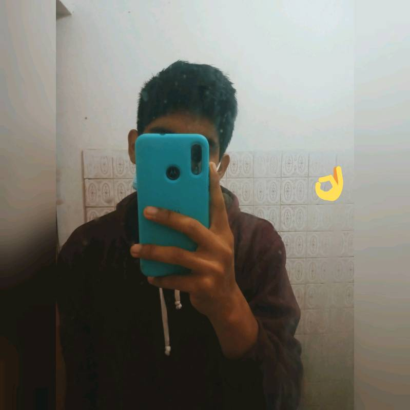

<h4>pagina web creado Con:</h4>
<ul>
    <li>PHP</li>
    <li>SweetAlert2</li>
    <li>Js</li>
    <li>Sass</li>
    <li>Figma - adobe xd</li>
    <li>Datatables</li>
    <li>Boostrap 5</li>
    <li>PHPMailer</li>
    <li>Btn Paypal</li>
    <li>Btn Mercado Pago</li>
    <li>FontAwesome</li>
    <li>Html</li>
</ul>    
 
Puedes Visualizarlo en los siguientes enlaces: 

<h3 class="py-4">VERCEL -- <i>nota<i> solo podra ver el codigo para ver el contenido haz click en 00webhost para que puedas visualizar el diseño y pagina web</h3>
<a href="miwebsite.vercel.app" title="Ver Proyecto">🙂 VERCEL APP</a> 

<h3 class="py-4">00WebHost</h3>
<a href="link" title="Ver Proyecto">🙂 00WebHost</a> 

<h3><b>Realizado por:</b> Fabrizio Barrios Saavedra (RFBS19)</h3>

